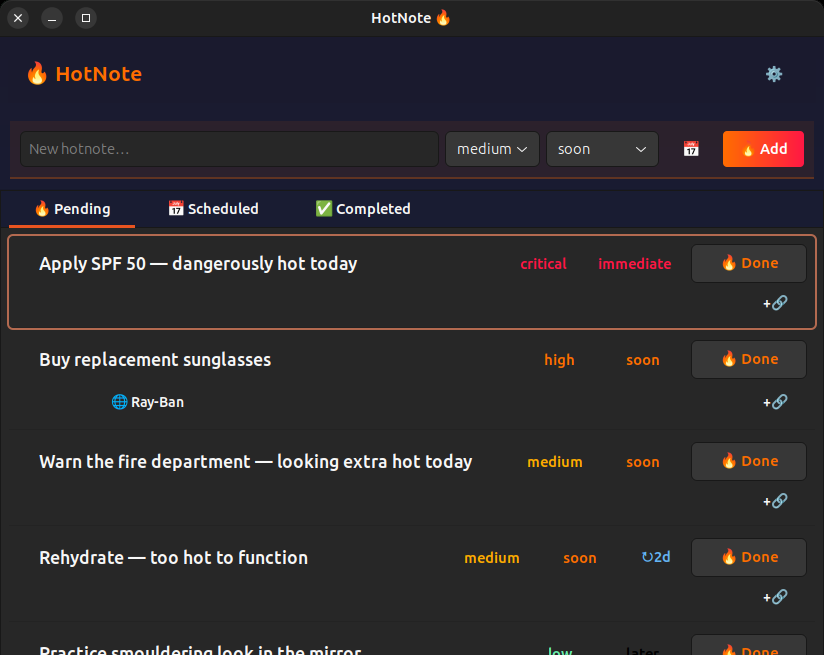

# HotNote

A lightweight personal task tracker for Ubuntu with a system tray indicator and a GTK window — all driven by a single JSON file and a CLI.



## Features

- **System tray indicator** — see pending hotnotes at a glance from the top bar
- **GTK window** — full view with add/done/reopen/delete, importance & urgency badges
- **Scheduled notes** — set a future date for a note to appear; it stays out of the way until then
- **Recurring notes** — set a repeat interval (days/weeks/months); completed notes move to scheduled and reappear when due
- **CLI** — scriptable `hotnote` command for adding, listing, and managing notes
- **Links & references** — attach URLs (opened in browser) or text references (copied to clipboard) to any hotnote
- **Hot theming** — warm fire-inspired colour scheme throughout

## Dependencies

HotNote needs Python 3.10+ and GTK 3 with AppIndicator support.

```bash
sudo apt install python3 python3-dateutil gir1.2-appindicator3-0.1 gir1.2-gtk-3.0 libnotify-bin
```

## Install

```bash
make install
```

This installs to `~/.local` by default. Override with `make install PREFIX=/usr/local` if you prefer a system-wide install (you'll need `sudo`).

After installing, either log out/in for the autostart entry to take effect, or start the indicator manually:

```bash
hotnote-indicator &
```

## Uninstall

```bash
make uninstall
```

## CLI Usage

```
hotnote add "Apply SPF 50 — dangerously hot today" --importance critical --urgency immediate
hotnote add "Rehydrate — too hot to function" --recur 2d --importance medium
hotnote add "Book photoshoot — the world deserves this" --appear 2026-06-01 --importance high
hotnote list
hotnote list --scheduled
hotnote list --all --links
hotnote done <id>
hotnote reopen <id>
hotnote set <id> --importance high --urgency soon
hotnote set <id> --recur none
hotnote set <id> --appear 2026-07-01
hotnote link <id> https://github.com/issue/123 "Auth issue"
hotnote link <id> "check the deploy logs on staging"
hotnote show <id>
hotnote delete <id>
hotnote open
```

### Link types

- **URL** — any value starting with `http://` or `https://` becomes a clickable web link (opened with `xdg-open`)
- **Text reference** — anything else becomes a reference that copies to clipboard when clicked

### Scheduling

Add `--appear` to schedule a note for a future date. It stays in the Scheduled tab until that date, then automatically moves to Pending.

```
hotnote add "Renew modelling insurance" --appear 2026-06-01
```

Combine with `--recur` for a recurring note that first appears on a specific date:

```
hotnote add "Skincare routine check-in" --appear 2026-05-16 --recur 2w
```

### Recurrence

Add `--recur` to make a hotnote repeat. When completed, it moves to scheduled until the next due date, then automatically reappears as pending.

| Spec | Meaning |
|---|---|
| `18d` | every 18 days |
| `2w` | every 2 weeks |
| `1m` | every 1 month |
| `none` | remove recurrence |

### Field values

| Field | Values (highest to lowest) |
|---|---|
| importance | `critical`, `high`, `medium`, `low` |
| urgency | `immediate`, `soon`, `whenever` |

Defaults: `--importance medium --urgency soon`

## Tests

```bash
make test
```

## Data

- Notes are stored in `~/.local/share/hotnote/hotnotes.json`
- Settings are stored in `~/.config/hotnote/config.json`

Back up these files to preserve your hotnotes and preferences.
